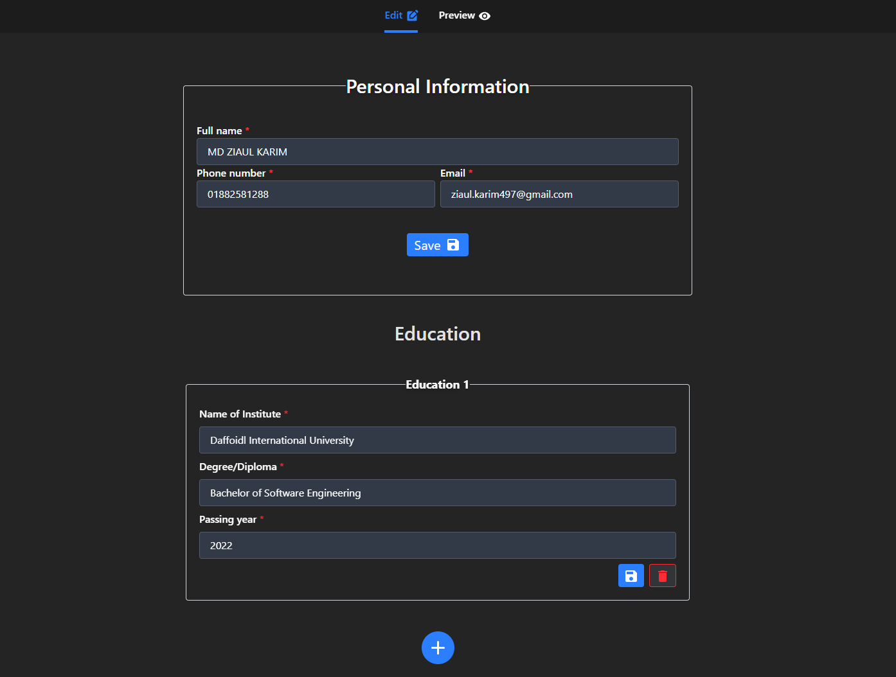
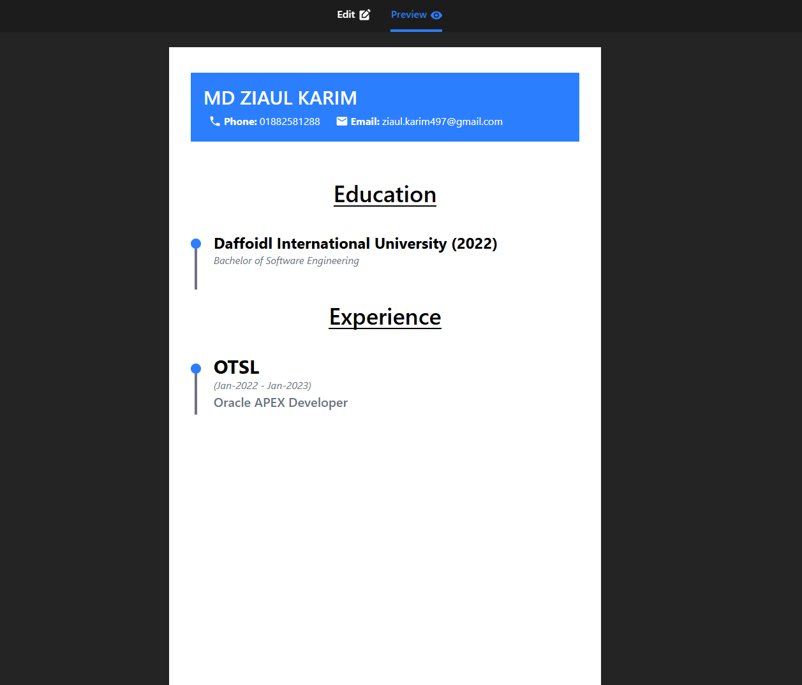
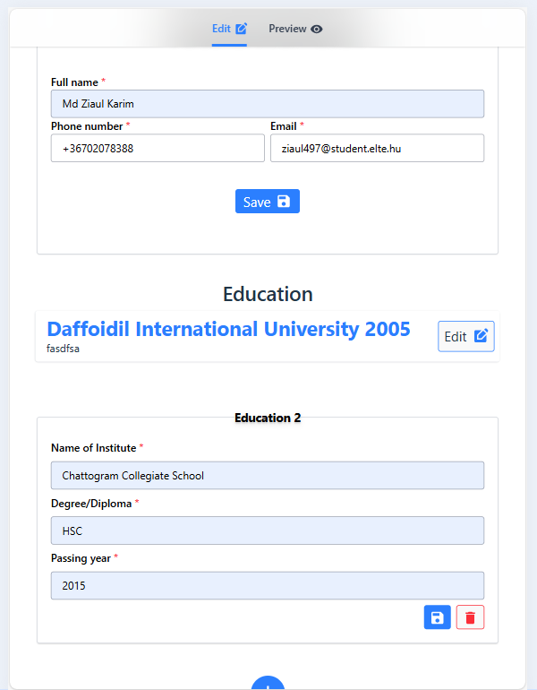
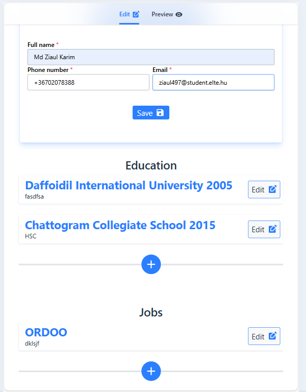
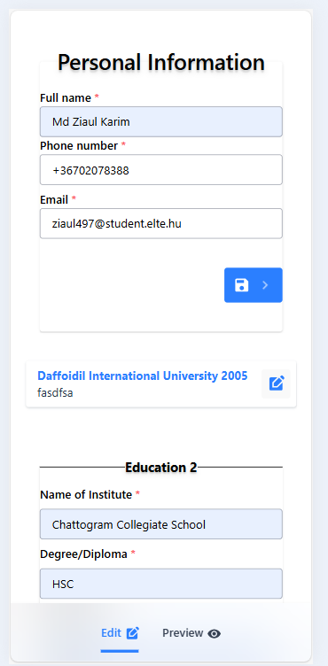
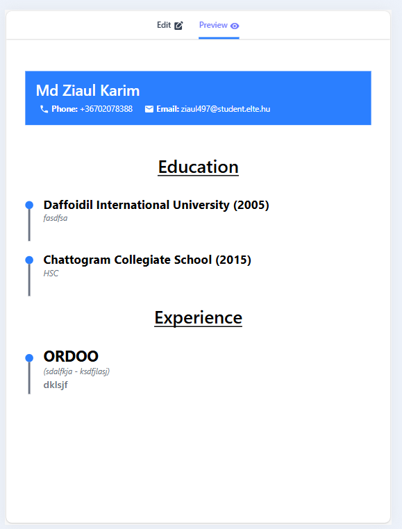
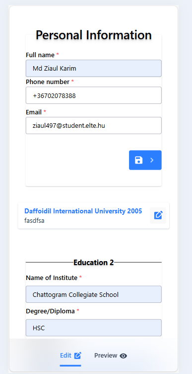
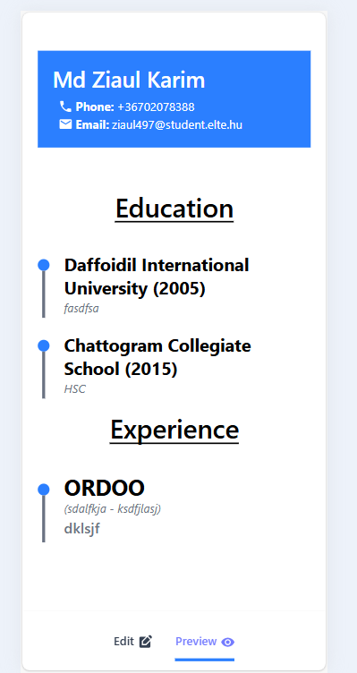

# Resume Hero

Fillup the form and get a resume ready instantly. 

**What this app does**: 

- Takes Dynamic User input via form.
- Renders a resume in a predetermined template in the preview section.
- UI has all devices support.

**Drawbacks**: 
- Data is completely reliant on two states (data, viewData)
- Form history is non-persistant (You lose your data with page refresh - that's a problem for another day).
- Can't print the resume yet. 
- Doesn't have more templates.
- Doesn't save data.
- Doesn't have SaaS characteristics.

**Is there any room to build upon it?**

Yes! A lot of room really. 

1. Templates are easy to add, so that's one checked. Since our `View` is separated, different templates are just different components. `View<Layout<Pages<[...TemplateComponents]`

2. Can it be a `SaaS`? Yes, it's a typical `SaaS` problem. We already followed an ORM schema to collect our data, they are type safe and all our forms need are API methods implemented in them to perform server side requests.

3. All we lack for a SaaS here: a Server for our API endpoints and a Database. Then we implement our user model to integrate our client side Data for storage. 

4. We need links! Shareable links for the resumes, one that stays the same even after updating the resume. Which should act like their portfolio website of some sort. But the user can choose to publish or unpublish their resume from that link, can also set timers for viewership and can also have analytics for specific sections in the resume.

**Note (Why this is a rudimentary solution):**

`viewData` is an immutable copy of the `data` changed with stateAction after every `setData()` operation. When `viewData` changes, the `View` component gets re-rendered by injection of `viewData` just in time. 

<h2> Let's have a look </h2>
 

---

### 1. Edit-mode

### 2. Preview-mode

### 3. Responsive Designs

